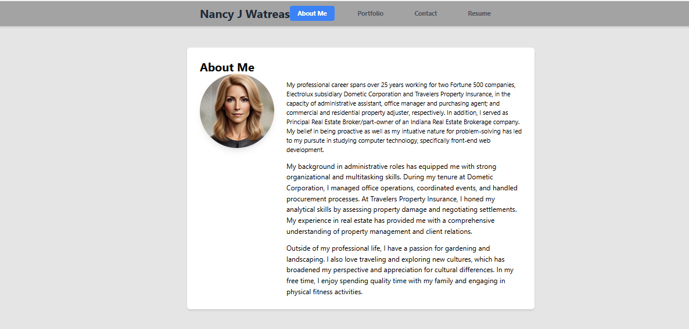
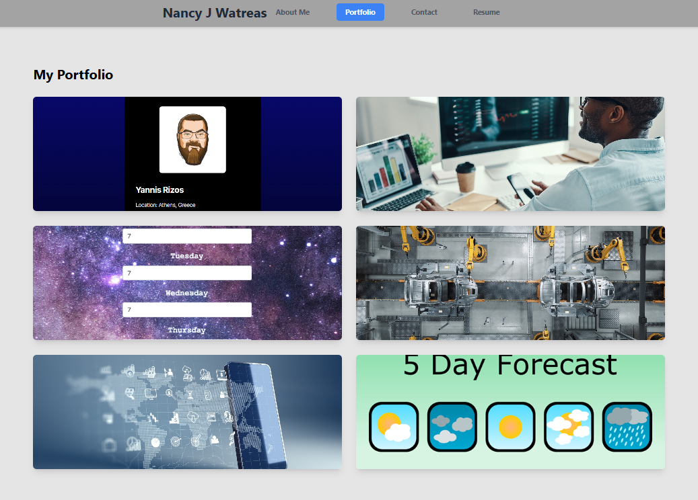
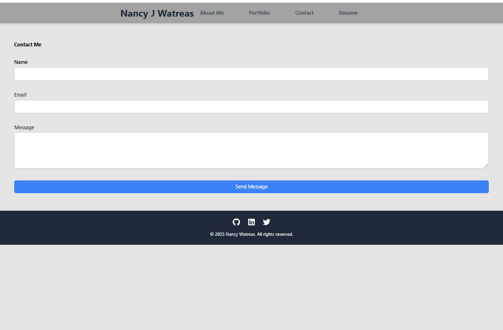
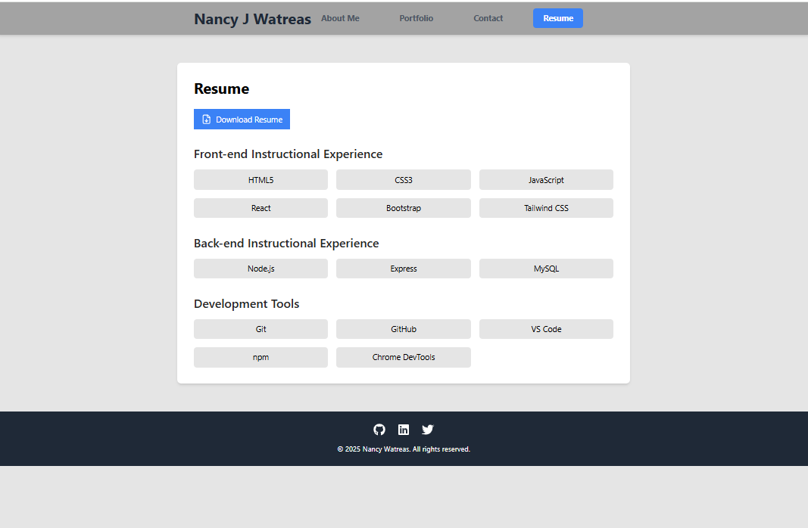

# React Portfolio - Experimental Website

## Description:
This is single-page application (SPA) portfolio created with Vite using a React template and Tailwind CSS for styling. This application is designed with a navigation bar and sections to display the user's professional profile, curriculum vitae, links to both deployed and CLI projects, a contact form page and a link to download the user's resume PDF.

## Website Links: 
- [GtHub Link](https://github.com/noIDEA-tech/12-REACT-Portfolio)
- [Netlify Link](https://portfolio-nw.netlify.app/)

## Table of Contents:
- [Installation](#installation)
- [Usage](#usage)
- [Credits](#credits)
- [License](#license)
- [Features](#features)
- [Tests](#tests)
- [Contact](#contact)

## Installation:
To run this application locally:
1. Clone the repository: git clone [your-repo-url]
2. Navigate to the project directory: cd my-portfolio
3. Install dependencies: `npm install`
4. Start the development server: `npm run dev`

## Usage
You can access the deployed application at [Portfolio](https://portfolio-nw.netlify.app/)

## Credits:
* Nancy Watreas 
* [Claude.ai](https://claude.ai), an AI assistant created by Anthropic. 
  Claude provided guidance on React component structure, Tailwind CSS implementation, and general coding best practices.

## License
MIT

## Features:
* Interactive User Interface
* Project Showcase with project cards with links to GitHub repositories and Deployed applications
* Contact Integration with form fields for name, email and messages
* Resume page with list of technologies used and a link to download Resume PDF 

## Tests
`npm run dev`

## Contact Info:
##### [github: https://github.com/noIDEA-tech](https://github.com/https://github.com/noIDEA-tech)
##### [email: nwatreas2023@gmail.com](mailto:nwatreas2023@gmail.com)
